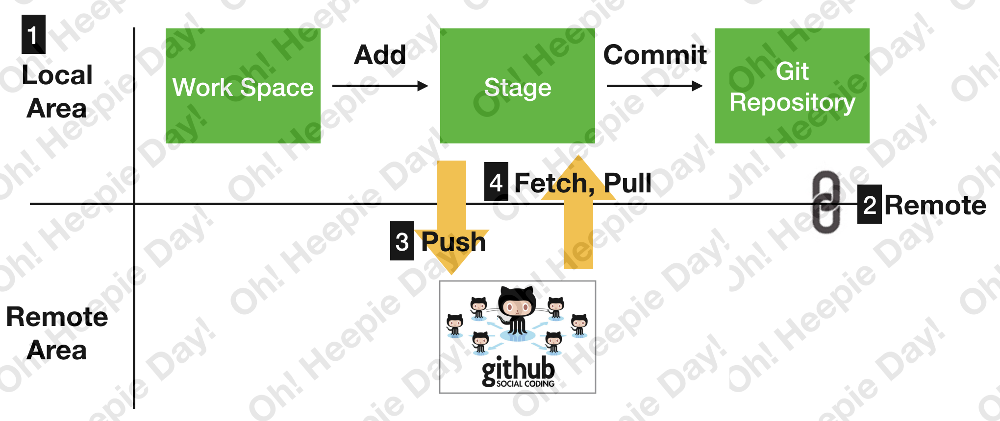

# git이란?
VCS (Version Control System) 중 하나로, 소스 코드를 관리하기 위한 툴 중 가장 많이 사용하는 툴입니다.

* ## git
**git의 전반적인 흐름**  

1. git을 설치 후 원하는 코드를 Local Repository(로컬 저장공간)에 commit한다.

2. 해당 Local Repository를 Remote Repository 반영하기 위해서는 'remote'명령어로 연결해주어야 한다.

3. 'push'명령어를 통해 Local Repository를 Remote Repository에 반영한다.

4. Remote Repository의 코드를 Local Work Space로 가져오기 위해서는 'fetch', 'pull' 등의 명령어가 있다.

* ## branch
Git의 branch는 여러 작업을 동시에 진행할 때 다른 작업자에게 영향을 주지 않고 작업 할 수 있게, 또한 작업을 한 눈에 파악할 수 있는 개념이다.    
**branch의 전반적인 흐름**  

1. branch 생성
<pre><code>git branch 해당 branch 이름
git push --set-upstream origin 해당 branch 이름</code></pre>

2. branch 변경 및 합병
<pre><code>git checkout 해당 branch 이름
git merge 해당 branch 이름</code></pre>

3. branch 삭제
<pre><code>git branch -d 해당 branch 이름
git push origin --delete 해당 branch 이름</code></pre>
